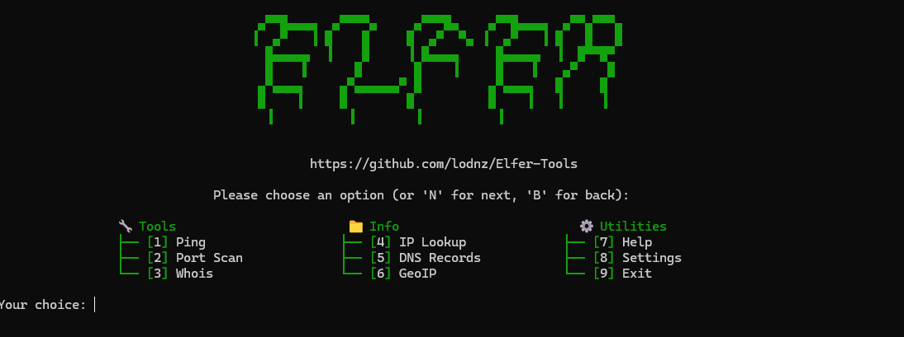

<h1 align="center">Elfer Tools</h1>

<p align="center">
Python Multi-tools.
  
  - Created by <a href="guns.lol/lodnz">lodnz</a><br>
  - Developed in <strong>Python</strong>.<br>
  - 100% <strong>Free</strong>.<br>

<h1 align="center">Showcase</h1>
  

<p>
  
<h1 align="center">Features</h1>
<p>
   
```
  - Ping IP
  - Port Scan
  - Whois
  - IP Lookup
  - DNS Records
  - GeoIP
  - Help
  - Settings
  - Exit
  - Traceroute
  - Reverse DNS
  - SSL Checker
  - ARP Scan
  - MAC Lookup
  - Subnet Info
  - Header Check
  - Breach Check
  - Speed Test
  - Username Lookup
  - Email Finder
  - Social Media Check
  - Google Dork Scanner
  - Phone Number Info
  - Public IP Info
  - Leaked Paste Search
  - File Metadata Viewer
  - Image EXIF Reader
  - Clear Cache & Temp

    More soon.


```
<br><br>
</p>

<h1 align="center">Installation</h1>

1. **Install** the required dependencies:
   ```bash
   pip install -r requirements.txt
   ```
2. **Open Elfer.py** with **Python.**

3. **Enjoy.**
